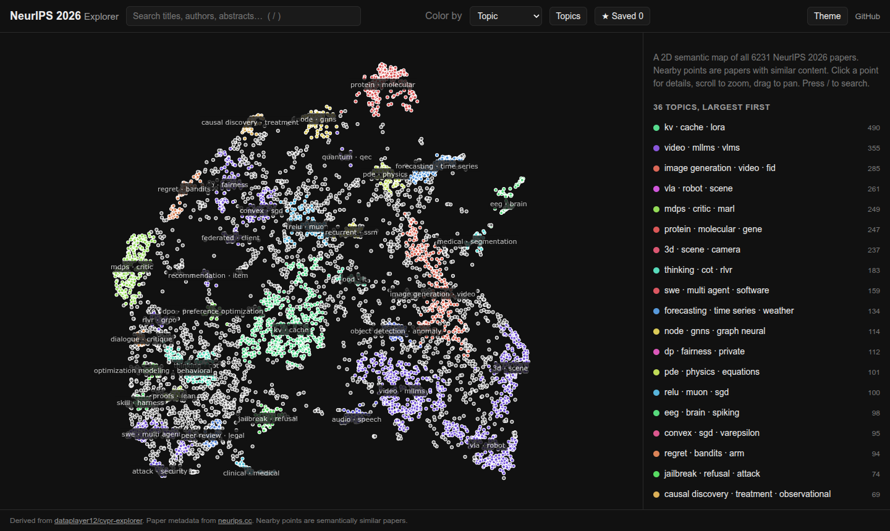
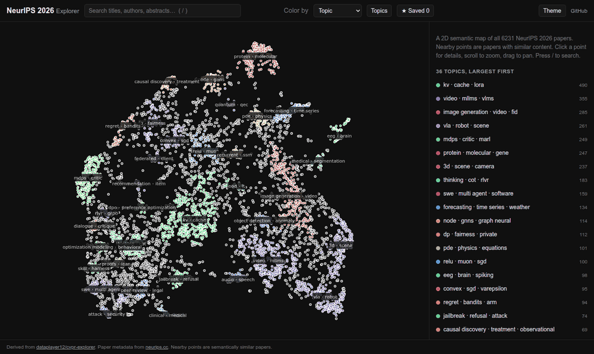
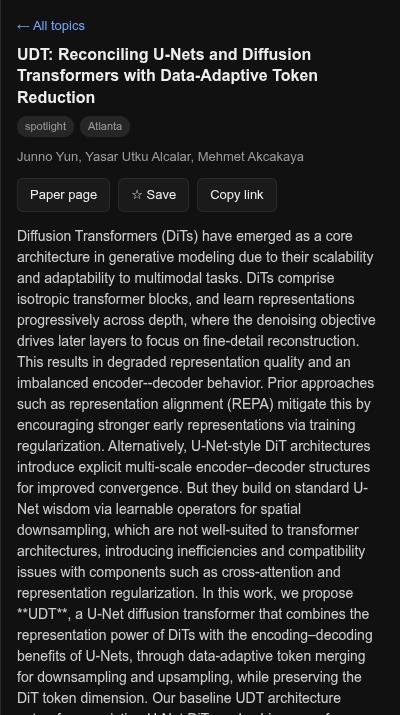

# NeurIPS 2026 Explorer

A 2D semantic map of the accepted NeurIPS 2026 papers, built from
[SPECTER2](https://huggingface.co/allenai/specter2) embeddings of titles and abstracts.
Nearby points are semantically similar papers, so a cluster is a topic.

**Live site: https://flecomet.github.io/neurips-explorer/**

Derived from [flecomet/cvpr-explorer](https://github.com/flecomet/cvpr-explorer). See
[Credits](#credits).

[](https://flecomet.github.io/neurips-explorer/)



## Status

The repository contains paper metadata, embeddings, and a generated map layout for 6,231
accepted papers. The Pages workflow builds the browser payloads and publishes `site/`.

- **OpenReview** has not released the 2026 papers (the venue group has `public_submissions = false`,
  and every 2026 query returns 0 notes while 2025 returns papers). It also answers scripts running
  on GitHub's servers with a human-verification challenge. `scrape.py` (OpenReview) is kept for
  when the papers are published.
- **neurips.cc** already lists the accepted papers per location (Sydney, Atlanta, Paris). Its
  listing pages are rendered by JavaScript from two JSON files
  (`/static/virtual/data/neurips-2026-orals-posters.json` and `...-abstracts.json`), which
  `scrape_site.py` downloads. The abstract extraction from a paper page was checked against the real
  site. The layout of the two JSON files was not known when the parser was written, so field names
  are looked up from lists of likely candidates, and every run prints the structure it found.
  `python scrape_site.py --probe` prints that structure without writing anything.

## Features

- Map of all papers with topic names drawn on it; more names appear as you zoom in.
- Color by topic, location (Sydney / Atlanta / Paris), presentation type (oral / spotlight / poster, also encoded by marker size)
  or OpenReview primary area. Palette for presentation type is colorblind-safe.
- Topics list: click a topic to zoom to it and list its papers.
- Search over titles, authors, keywords, TL;DR and abstracts. Matches stay in place, the rest dim.
- Author search: choose Authors to preview papers by partial name, then select suggestions to build a manual group.
  Rounded author buttons in paper details select one author. Results count shared papers once, show topic counts,
  and offer Fit matching papers without changing the viewport automatically.
- Paper panel: abstract, TL;DR, keywords (click to search), PDF and OpenReview links, and the six
  most similar papers.
- Save papers to a list kept in the browser (localStorage), export as CSV or Markdown.
- Shareable URLs: `?p=<paper id>`, `?q=<search>`, `?c=<topic>`, `?color=<mode>`,
  and `?scope=authors&author=<name>&author=<another name>`. Author selections persist when opening or saving papers.
- Light and dark themes, keyboard shortcuts (`/` search, `Esc` clear), usable on a phone.
- Fast start: the map (`data.json`, a few hundred KB gzipped) loads first, abstracts
  (`details.json`) load afterwards.

## Reading the map

Each point is one paper. Position comes from the title and abstract: papers with similar text
land close together. Colours mark topics, and topic names are drawn on the map. Papers that fit
no topic share one neutral colour and are listed as "unclustered".

Clicking a point opens the paper panel, shown here.



Author groups are assembled manually. The data has no affiliations or author identifiers. Identical full names
combine papers across people, while spelling variants remain separate. Matching ignores case, Unicode representation,
and extra whitespace, but preserves accents and punctuation.

Distances are approximate. UMAP, the 2D projection method, preserves local neighbourhoods
better than global distances. Read "these two papers are close" as meaningful, and "this topic
is twice as far away as that one" as unreliable.

## Largest topics

The pipeline finds 36 topics. A further 2074 of the 6231 papers (33%) belong to none of them.
Topic names are generated automatically from the paper text.

| Papers | Topic name |
|-------:|------------|
| 490 | kv · cache · lora |
| 355 | video · mllms · vlms |
| 285 | image generation · video · fid |
| 261 | vla · robot · scene |
| 249 | mdps · critic · marl |
| 247 | protein · molecular · gene |
| 237 | 3d · scene · camera |
| 183 | thinking · cot · rlvr |

## How it works

The pipeline is offline and the site is static (no backend, no API keys at serve time).

| Step | Script | Output |
|------|--------|--------|
| Fetch accepted papers from neurips.cc (or OpenReview) | `scrape_site.py` (`scrape.py`) | `data/neurips_2026_papers.json` |
| Embed title + abstract with SPECTER2 | `embed.py` | `data/neurips_2026_specter2.npy` (float16) |
| UMAP to 2D, HDBSCAN clusters, TF-IDF topic names, nearest neighbours | `layout.py` | `data/neurips_2026_layout.json` |
| Merge into the site payload | `build_site.py` | `site/data.json`, `site/details.json` |

`layout.py` runs UMAP on the cosine-normalised embeddings, then HDBSCAN, a density-based
clustering method, on the 2D coordinates. Topic names use TF-IDF: terms score high when they
are frequent in one topic and rare in the others.

`templates/index.html` is the page template. `build_site.py` writes it to `site/index.html`,
which renders the payload client-side with plotly.js.

## Setup

1. Create the GitHub repository (public: GitHub Pages is free only for public repositories),
   push this code to `main`.
2. Settings, Pages, Source: **GitHub Actions**.
3. When `data/neurips_2026_layout.json` is present, run **Deploy site to GitHub Pages** in the
   Actions tab. To generate or refresh the data, run **Refresh data** with source `neurips.cc`.
   It runs the whole pipeline on a GitHub runner, commits `data/`, and starts the Pages
   deployment. Embedding on a CPU takes tens of minutes. The **Probe neurips.cc** step prints
   what the site returned; if scraping fails, that output shows what the parser needs to change.
4. Other sources: `committed` uses `data/neurips_2026_papers.json` as it is in the repository.
   `openreview` does not work from GitHub runners (human-verification challenge). Once OpenReview
   publishes the papers, scrape from your own machine with `python scrape.py`. Commit the data
   and run the workflow with source `committed`. The venue ids are in [`config.py`](config.py).

## Run locally

To view the committed paper data and map layout, build the browser payloads and serve them:

```shell
python build_site.py
python -m http.server --directory site 8000
```

Open http://localhost:8000/. Opening `site/index.html` directly as a local file prevents the
browser from fetching the paper data. `site/data.json` and `site/details.json` are generated
files and are rebuilt after cloning or updating the repository.

To regenerate the paper data, embeddings, and layout:

```shell
pip install -r requirements-pipeline.txt
python scrape_site.py   # neurips.cc; for OpenReview: python scrape.py
python embed.py         # GPU recommended, CPU works
python layout.py        # --min-cluster-size 25 --n-neighbors 15
python build_site.py
python -m http.server -d site 8000   # http://localhost:8000
```

Tests: `pip install -r requirements-dev.txt && python -m pytest`.

## Notes

- `layout.py` is deterministic for fixed inputs (UMAP `random_state=42`) so reruns keep the map
  stable. Changing the embeddings or paper set changes the map.
- Roughly a third of papers can end up "unclustered" at `--min-cluster-size 25`. Lower it for
  more, smaller topics.
- Saved papers never leave the browser.

## Shared template

This repository is the template source for the sister explorers, currently
[cvpr-explorer](https://github.com/flecomet/cvpr-explorer). The files listed in `SHARED` in
`sync_template.py` read every conference-specific value from `config.py`, and
`build_site.py` renders `templates/index.html` into `site/index.html`. Edit shared files
here, then copy them across:

    python sync_template.py ../cvpr-explorer --test    # run its tests with these files
    python sync_template.py ../cvpr-explorer --check   # list differing files
    python sync_template.py ../cvpr-explorer           # copy them

The "Sister explorers" workflow runs the `--test` step for each sister on every push.

## Credits

Derived from [flecomet/cvpr-explorer](https://github.com/flecomet/cvpr-explorer), itself a fork
of [dataplayer12/cvpr-explorer](https://github.com/dataplayer12/cvpr-explorer). The original
idea and design are by [@dataplayer12](https://github.com/dataplayer12). Same licence as
upstream, see [LICENSE](LICENSE).
